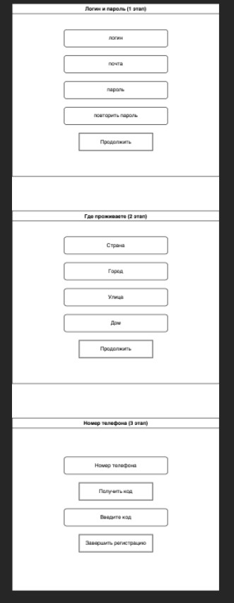
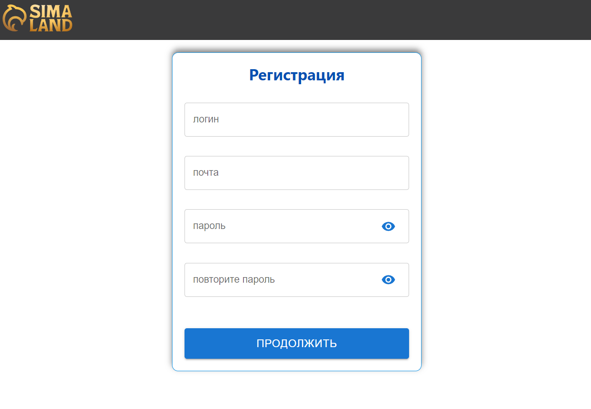
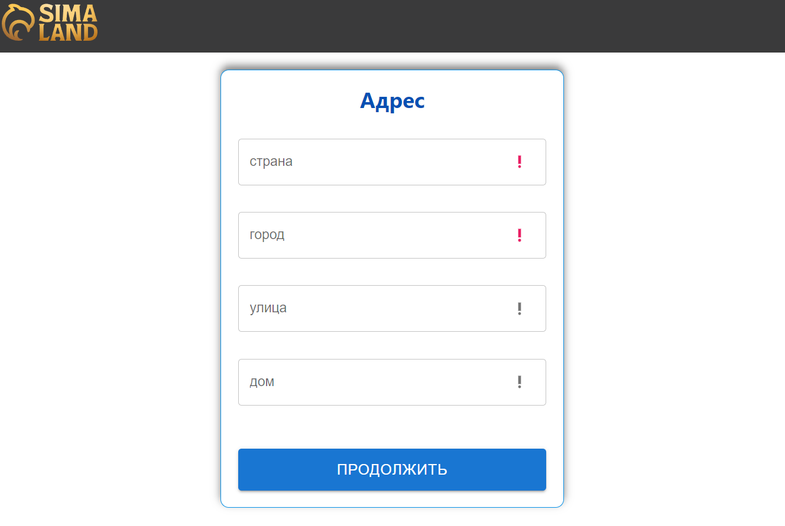
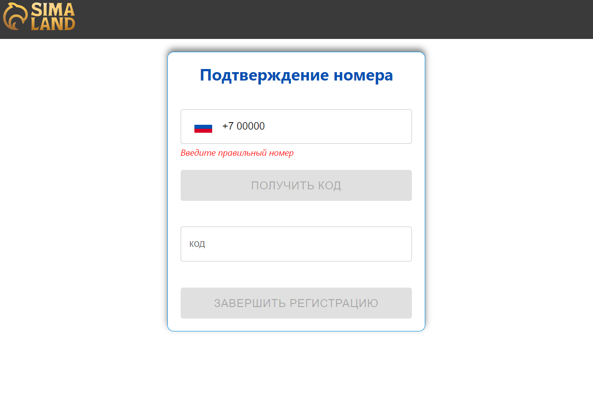

This project was bootstrapped with [Create React App](https://github.com/facebook/create-react-app).

# Тестовое задание Sima-Land (Frontend) #
## Задание
Реализуйте SPA приложение регистрации пользователя.
Необходимо реализовать поэтапный механизм регистрации пользователей.

## Этапы

## Стек
Обязательно использование React 17 и выше. На выбор 
Redux/Redux-toolkit/Context.\
Дизайн приложения может быть простым. Любая дизайн система 
Bootstrap/Mui/Antd и т. п. (или css/scss).\
Остальные библиотеки на ваше усмотрение.

## Условия
Пользователь должен заполнить поля для прохождения каждого этапа.\
Некоторые поля сделать обязательными. Валидировать поля не нужно.\
Основная задача - реализовать механизм прохождения этапов.\
Также нужно учесть, что в будущем планируется добавлять новые этапы в любой 
последовательности.

## Будет плюсом
Реализовать механизм, открывающий этап, на котором остановился пользователь 
(при перезагрузке страницы).

## Реализация

## В проекте установлены следующие библиотеки
- **React**
- **Redux**
- **React-Redux**
- **React-Router-dom**
- **Redux-Thunk**
- **Material UI**
- **mui-tel-input**
- **Formik**
- **Incubator-cli**

## Доступные скрипты

После git clone установите все зависимости из package.json:

### `yarn`

Для запуска проекта:

### `yarn start`

Приложение запуститься в браузере на порту

[http://localhost:3000](http://localhost:3000)

## Developers
- **[Segey Lalakin](https://github.com/Rumata-SL)**
